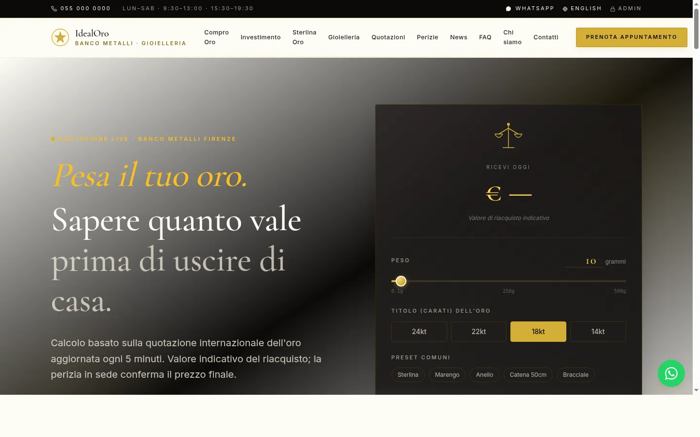
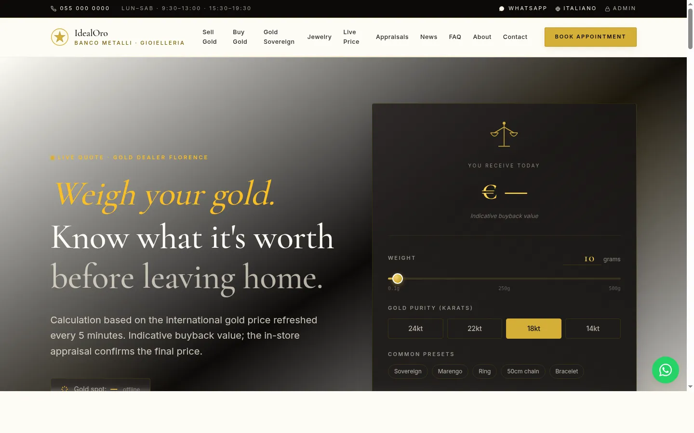
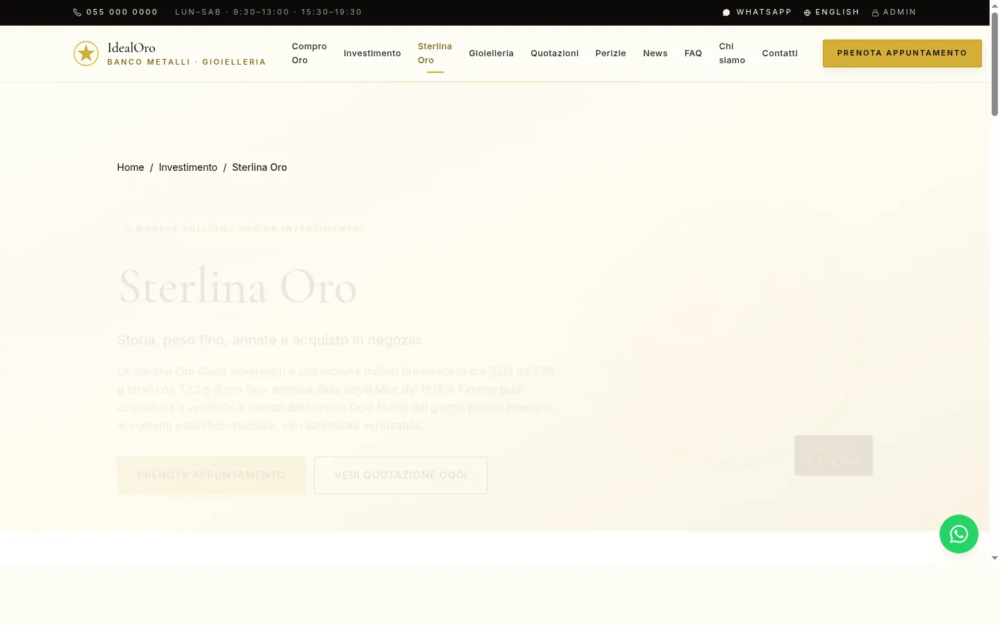
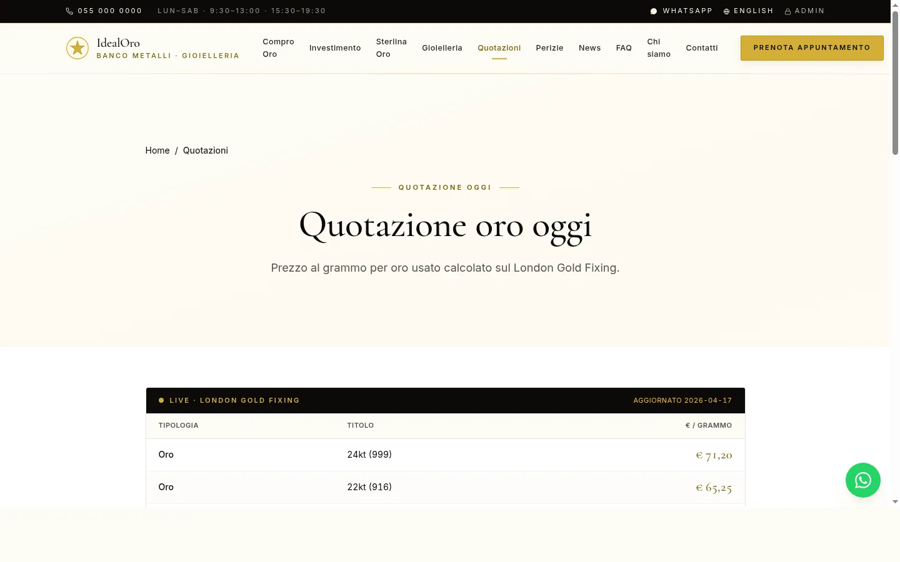
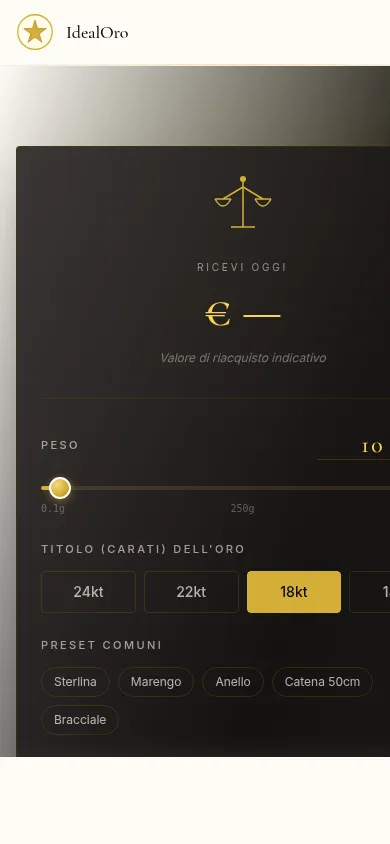

<div align="center">

# IdealOro

**Demo template: luxury business-card site for a Banco Metalli.**
**Template demo: sito vetrina di lusso per un Banco Metalli.**

[](https://astro.build/)
[](https://www.typescriptlang.org/)
[](https://tailwindcss.com/)
[](#features)
[](#license)
[](https://florenceegi.com)



</div>

---

## Overview

**Live preview:** [preview.florenceegi.com](https://preview.florenceegi.com)

Static marketing site template for a **Banco Metalli** (gold-trading firm). Built with **Astro 5 SSG**, fully bilingual **IT / EN**, cinematic yet restrained UX, strict WCAG AA and schema.org coverage end-to-end.

Published as a **demo template** by **FlorenceEGI WebAgency** — our specialty is business-card sites for high-trust professionals (gold traders, lawyers, jewellers, notaries) where **credibility, bilingual reach and SEO** matter more than animations.

---

## Features

### Content — 24 pages, 2 locales
- Homepage with **interactive gold scale** (weight, karat, presets, live price)
- Verticals: **Compro Oro / Investimento / Sterlina Oro / Gioielleria / Perizie / Quotazioni**
- Institutional: Chi siamo / Contatti / FAQ (8 Q&A)
- Legal: Privacy (GDPR) / Cookie / footer compliance strip
- Blog / News: 4 seed posts (2 IT + 2 EN) via Astro Content Collections + MDX
- Complete EN mirror: `/en/sell-gold`, `/en/buy-gold`, `/en/sovereigns`, `/en/jewelry`, `/en/appraisals`, `/en/live-price`, `/en/faq`, `/en/news`, ...

### UX — Cinematic but tasteful
- **Interactive gold scale** — real-time valuation with weight slider, karat selection, common presets
- **Reveal on scroll** (IntersectionObserver, GPU-only transforms)
- **Magnetic CTAs**, particle hero background, lightbox gallery
- **Live gold price ticker** (mock feed, hook-ready for real API)
- **Timeline storytelling** on the Sterlina Oro page (four centuries of history)
- **Compliance strip** in footer: OAM, Codice Antiriciclaggio, Banca d'Italia references

### SEO & Schema.org
- 7 schema types: `LocalBusiness`, `Service`, `FAQPage`, `BreadcrumbList`, `Article`, `Product`, `WebSite`
- Sitemap i18n-aware (`it-IT` / `en-US`) via `@astrojs/sitemap`
- `hreflang` tags, canonical URLs, OpenGraph, Twitter cards

### Accessibility
- Semantic HTML (`<nav>`, `<main>`, `<article>`, `<footer>`)
- Every icon-only button has `aria-label`; every form control has `<label for=...>`
- Colour contrast AA minimum (gold/ivory/charcoal palette)
- Keyboard-navigable throughout, focus rings visible, reduced-motion respected

### Performance
- **SSG** — zero JS by default, islands only where needed
- Image pipeline via `sharp` (WebP, AVIF, responsive `srcset`)
- Prefetch-on-viewport for internal links
- Inline critical CSS
- Lighthouse targets: **95+ / 100 / 95+ / 100** (Perf / A11y / BP / SEO)

### i18n architecture
- Astro native `i18n` config (`defaultLocale: 'it'`, prefix `/en` for English)
- Shared components (`Hero`, `Nav`, `Footer`), content duplicated per locale under `src/pages/` and `src/pages/en/`
- `hreflang` autoprinted on all pages

### Contact form — no backend required
- Pure `<form action="mail.php">` — classic PHP handler on static hosting with PHP (or swappable for serverless / Formspree / Cloudflare Worker)

---

## Screenshots

<table>
  <tr>
    <td></td>
    <td></td>
  </tr>
  <tr>
    <td align="center"><sub>Homepage IT — gold scale + live valuation</sub></td>
    <td align="center"><sub>Homepage EN — full bilingual mirror</sub></td>
  </tr>
  <tr>
    <td></td>
    <td></td>
  </tr>
  <tr>
    <td align="center"><sub>Sterlina Oro — timeline + investment info</sub></td>
    <td align="center"><sub>Quotazioni — London Gold Fixing ticker</sub></td>
  </tr>
</table>

<div align="center">
  
  <p><sub>Mobile-first — iPhone viewport</sub></p>
</div>

---

## Stack

| Layer | Choice | Why |
|-------|--------|-----|
| Framework | **Astro 5.18** | SSG by default, zero-JS HTML, islands where needed |
| Language | **TypeScript 5.9 strict** | Type safety on components, content collections, config |
| Styling | **Tailwind v4.1** | `@tailwindcss/vite` plugin — CSS-first theming, no config file |
| Content | **Astro Content Collections + MDX** | Type-safe frontmatter, markdown blog posts |
| i18n | **Astro native** | `/` for IT, `/en` for EN, shared components |
| Icons | **Inline SVG** | No icon font, no runtime dep, accessible |
| Hosting | **AWS EC2** | SSG deploy via GitHub Actions + SSM |
| Contact form | **PHP `mail.php`** | Zero-JS fallback, swappable for serverless |

---

## Project structure

```
src/
├── components/             # Shared .astro components
│   ├── Hero.astro          # Gold scale + cinematic headline
│   ├── Nav.astro           # Responsive nav + language switcher
│   ├── Footer.astro        # Compliance strip + links
│   ├── GoldScale.astro     # Interactive gold valuation tool
│   ├── GoldQuoteTable.astro
│   ├── ContactForm.astro
│   ├── FAQItem.astro
│   ├── ServiceCard.astro
│   └── WhatsAppFab.astro
├── content/
│   ├── blog/               # IT + EN markdown posts
│   └── config.ts           # typed Content Collections schema
├── layouts/                # Base + page layouts
├── pages/
│   ├── index.astro         # IT homepage
│   ├── sterline.astro
│   ├── compro-oro.astro
│   ├── investimento.astro
│   ├── gioielleria.astro
│   ├── perizie.astro
│   ├── quotazioni.astro
│   ├── faq.astro
│   ├── contatti.astro
│   ├── chi-siamo.astro
│   ├── privacy.astro
│   ├── cookie.astro
│   ├── blog/
│   └── en/                 # full English mirror
├── scripts/                # TS islands
└── styles/                 # Tailwind entry + custom CSS
public/
├── favicon.svg
├── manifest.webmanifest
├── robots.txt
├── mail.php
└── images/
```

---

## Run locally

```bash
npm install
npm run dev          # http://localhost:4330
npm run build        # production → dist/
npm run preview      # preview built site
```

---

## Deployment

Deployed on **AWS EC2** via **GitHub Actions** (push to `main` triggers SSM deploy).

Live at: [preview.florenceegi.com](https://preview.florenceegi.com)

---

## Browser support

Modern evergreen — **Chrome, Safari, Firefox, Edge** (last 2 versions). CSS uses `@layer`, container queries, custom properties. Mobile tested on iOS 17+, Chrome Android 120+.

---

## License

**Proprietary — FlorenceEGI WebAgency. All rights reserved.**

This repository is public for **portfolio and transparency** purposes only.
Code, copy, design and assets are **not licensed** for reuse, redistribution, or derivative works without written permission from FlorenceEGI WebAgency.

For licensing inquiries or a similar build for your brand: [fabiocherici@gmail.com](mailto:fabiocherici@gmail.com)

---

<div align="center">

**Built by [FlorenceEGI WebAgency](https://florenceegi.com)**
_Padmin D. Curtis (AI Partner OS3.0) for Fabio Cherici_

_Part of the FlorenceEGI organism — Oracode OS3.0_

</div>
